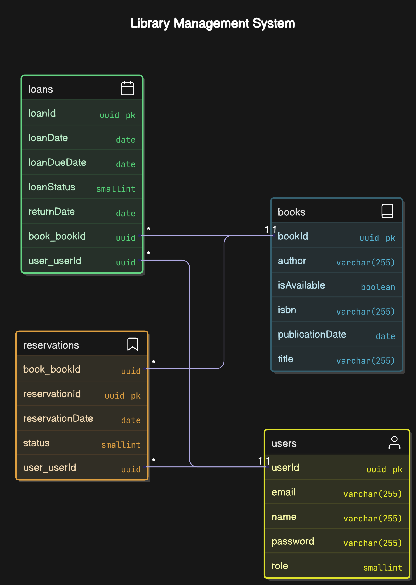

# V2com Library Training

This project was proposed by <a href="https://v2com.com/">V2com</a> to teach college scholarship students how to use Quarkus, Docker, and the MVC pattern. Through this training, it's possible to develop practical skills in building Java Quarkus mainly.

## Project Structure

<details>
<summary>How it was created?</summary>
It was created using the MVC model, that is a pattern that separates an application's logic into three parts: model, the view and the controller. We can see the base structure below:

```
V2com-Library-Training-api/
│── src/
│   ├── main/
│   │   ├── java/com/example/V2com-Library-Training/
│   │   │   ├── entity/
│   │   │   │   ├── Book.java
│   │   │   │   ├── User.java
│   │   │   │   ├── Loan.java
│   │   │   │   ├── Reservation.java
│   │   │   │   ├── enums/
│   │   │   │   │   ├── LoanStatus.java
│   │   │   │   │   ├── ReservationStatus.java
│   │   │   │   │   ├── UserRole.java
│   │   │   ├── repository/
│   │   │   │   ├── BookRepository.java
│   │   │   │   ├── UserRepository.java
│   │   │   │   ├── LoanRepository.java
│   │   │   │   ├── ReservationRepository.java
│   │   │   ├── service/
│   │   │   │   ├── BookService.java
│   │   │   │   ├── UserService.java
│   │   │   │   ├── LoanService.java
│   │   │   │   ├── ReservationService.java
│   │   │   ├── controller/
│   │   │   │   ├── BookController.java
│   │   │   │   ├── UserController.java
│   │   │   │   ├── LoanController.java
│   │   │   │   ├── ReservationController.java
│   │   │   ├── dto/
│   │   │   │   ├── BookDTO.java
│   │   │   │   ├── UserDTO.java
│   │   │   │   ├── LoanDTO.java
│   │   │   │   ├── ReservationDTO.java
│   ├── resources/
│   │   ├── application.properties
│── pom.xml
```

</details>

### Entities Description

> 💡 Below, some entities receive other entities in there structure, like `Loan`, tha receive `User` and `book`. In the database they were recorded as UUID's, but in code/ORM on moust routes is sent a DTO with UUID's and recorded by using entities/objects.

Below it's possible to find the written and image description:

<details>
<summary>Diagram</summary>

#### Book
- **Attributes:**
    - `id` (UUID): Unique identifier for the book.
    - `title` (String): Title of the book.
    - `author` (String): Author of the book.
    - `isbn` (String): ISBN number of the book.
    - `publishedDate` (LocalDate): Date when the book was published.
    - `status` (String): Current status of the book (e.g., available, borrowed).

- **Relationships:**
    - One-to-Many with `Loan`: A book can have multiple loans.
    - One-to-Many with `Reservation`: A book can have multiple reservations.

#### User
- **Attributes:**
    - `id` (UUID): Unique identifier for the user.
    - `name` (String): Name of the user.
    - `email` (String): Email address of the user.
    - `password` (String): Password for the user's account.
    - `role` (UserRole): Role of the user (e.g., admin, member).

- **Relationships:**
    - One-to-Many with `Loan`: A user can have multiple loans.
    - One-to-Many with `Reservation`: A user can have multiple reservations.

#### Loan
- **Attributes:**
    - `id` (UUID): Unique identifier for the loan.
    - `bookId` (UUID): Identifier of the borrowed book.
    - `userId` (UUID): Identifier of the user who borrowed the book.
    - `loanDate` (LocalDate): Date when the loan was made.
    - `returnDate` (LocalDate): Date when the book is expected to be returned.
    - `status` (LoanStatus): Current status of the loan (e.g., active, returned).

- **Relationships:**
    - Many-to-One with `Book`: A loan is associated with one book.
    - Many-to-One with `User`: A loan is associated with one user.

#### Reservation
- **Attributes:**
    - `id` (UUID): Unique identifier for the reservation.
    - `bookId` (UUID): Identifier of the reserved book.
    - `userId` (UUID): Identifier of the user who reserved the book.
    - `reservationDate` (LocalDate): Date when the reservation was made.
    - `status` (ReservationStatus): Current status of the reservation (e.g., active, fulfilled).

- **Relationships:**
    - Many-to-One with `Book`: A reservation is associated with one book.
    - Many-to-One with `User`: A reservation is associated with one user.

</details>

<details>
<summary>Example image of the Diagram</summary>



</details>

## How Routes works

> 💡 You can see all the routes and test how they work by accessing http://localhost:8080/q/swagger-ui/ for a better view!

See the routes in the dropdown below:
<details>
<summary>Routes</summary>

### Users
Users can register, update their information, and delete their accounts. They can also borrow and reserve books.

- **Routes:**
    - `POST /users` - Register a new user;
    - `GET /users/{id}` - Get user details by searching by filter;
    - `GET /users` - Get users by filter on UriInfo (`endpoint?filterName=filterValue`);
    - `PATCH /users/{id}` - Update user information;
    - `DELETE /users/{id}` - Delete a user.

### Books
Books can be added, updated, and deleted by the library staff. Users can view book details.

- **Routes:**
    - `POST /books` - Add a new book;
    - `GET /books/{id}` - Get book details;
    - `GET /books` - Get books by filter on UriInfo (`endpoint?filterName=filterValue`);
    - `PATCH /books/{id}` - Update book information;
    - `DELETE /books/{id}` - Delete a book.

### Loans
Users can borrow books, and the system tracks the loan status.

- **Routes:**
    - `POST /loans` - Create a new loan;
        - If the book is already borrowed, automatically creates a new reservation;
    - `GET /loans/{id}` - Get loan details;
    - `GET /loans` - Get loan by filter on UriInfo (`endpoint?filterName=filterValue`);
    - `PATCH /loans/{id}` - Update loan information;
    - `DELETE /loans/{id}` - Delete a loan.

### Reservations
Users can reserve books, and the system tracks the reservation status.

- **Routes:**
    - `POST /reservations` - Create a new reservation;
        - If there are no Loans for the select book, it's created automatically a new Loan;
    - `GET /reservations/{id}` - Get reservation details;
    - `GET /reservations` - Get reservation by filters on UriInfo (`endpoint?filterName=filterValue`);
    - `PATCH /reservations/{id}` - Update reservation information;
    - `DELETE /reservations/{id}` - Delete a reservation.

</details>

## Libraries Used

- [Quarkus](https://quarkus.io/);
- [JUnit](https://junit.org/junit5/);
- [RESTEasy](https://resteasy.github.io/);
- [Hibernate ORM](https://hibernate.org/orm/);
- [Docker](https://www.docker.com/);
- [JDBC PostgreSQL](https://jdbc.postgresql.org/);
- [Flyway](https://flywaydb.org/);
- [SmallRye OpenAPI](https://smallrye.io/smallrye-open-api/);
- [SmallRye JWT](https://smallrye.io/smallrye-jwt/);
- [SmallRye JWT Build](https://smallrye.io/smallrye-jwt-build/).

## `.env` Configuration

Create a `.env` file in the root of the project with the following variables:

```
POSTGRES_DB=library
POSTGRES_USER=your_own_db_user
POSTGRES_PASSWORD=your_own_db_password
QUARKUS_DATASOURCE_JDBC_URL=jdbc:postgresql://localhost:5432/library
QUARKUS_DATASOURCE_JDBC_URL_DOCKER=jdbc:postgresql://db:5432/library
QUARKUS_DATASOURCE_USERNAME=your_own_db_user
QUARKUS_DATASOURCE_PASSWORD=your_own_db_user
```

## Running the Program

On both ways to start the program, execute commands in root folder:

### With Docker

1. Create the project .jar:
    ```sh
    ./mvnw package -DskipTests
    ```

2. Build the Docker image:
    ```sh
    docker build -f src/main/docker/Dockerfile.jvm -t quarkus/library-jvm .
    ```

3. Change the tag of container:
    ```sh
    docker tag quarkus/library-jvm:latest quarkus/library-jvm:1.0.0-SNAPSHOT
    ```

4. Remove old container:
    ```sh
    docker rmi quarkus/library-jvm:latest
    ```

5. Run docker compose:
    ```sh
    docker-compose up
    ```

### With Maven/Quarkus from the Terminal

1. Create the project .jar:
    ```sh
    ./mvnw package -DskipTests
    ```

2. Run the project:
    ```sh
    ./mvnw quarkus:dev
    ```

Done! The project will be running at `http://localhost:8080`.